# Architecture concepts — shared legend

Applies to every diagram in this folder (issue #73). The point of the
legend is one distinction the current product blurs: **a voice persona is
not the same thing as an agent.** A persona is a speaking identity (name +
ElevenLabs voice + character prompt). What it's attached to — a heavy
session, an orchestrator, a cheap router — is the whole design question.

```mermaid
flowchart TB
  classDef owner fill:#f5c542,stroke:#8a6d1a,color:#1a1a1a
  classDef voice fill:#a78bfa,stroke:#6d28d9,color:#1a1a1a
  classDef orch fill:#60a5fa,stroke:#1d4ed8,color:#1a1a1a
  classDef session fill:#f87171,stroke:#b91c1c,color:#1a1a1a
  classDef worker fill:#5eead4,stroke:#0f766e,color:#1a1a1a,stroke-dasharray:5 4
  classDef memory fill:#86efac,stroke:#15803d,color:#1a1a1a
  classDef plumbing fill:#d4d4d8,stroke:#71717a,color:#1a1a1a

  O["🧑 Owner — you, on Mac or phone"]:::owner
  V["🎙 Voice persona — speaking identity; costs TTS per character when it talks"]:::voice
  R["🧠 Orchestrator — keeps the loop moving; holds the plan; dispatches + integrates"]:::orch
  S["⚙️ Long-running session — heavy model, accumulated context; expensive per wakeup; state dies at /clear"]:::session
  W["⚡ Short-lived worker — fresh context, does one job, context discarded; result survives"]:::worker
  M["🗂 Shared memory — files, git, memory dir, state JSON; survives every session"]:::memory
  P["plumbing — silent infra: daemon, queue, hooks, transports"]:::plumbing
```

Reading the diagrams:

- A node can wear **two hats** (e.g. `⚙️🎙` = a heavy session that also
  speaks — today's personas). Layering proposals are mostly about
  *un-stacking* these hats.
- **Solid arrows** = the normal path. **Dashed arrows** = optional /
  intermittent (live-mode tails, delegate spawns).
- Cost annotations: `$` = per-use API spend (TTS is the expensive one,
  heavy-model wakeups the *very* expensive one); unmarked = ≈ free.
- "What dies when a session ends" is called out per diagram — it's one of
  the three questions every layering must answer (who holds conversational
  state, who spends credits, what dies).
