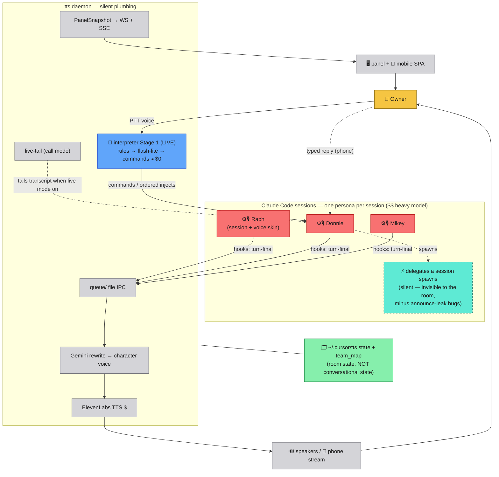
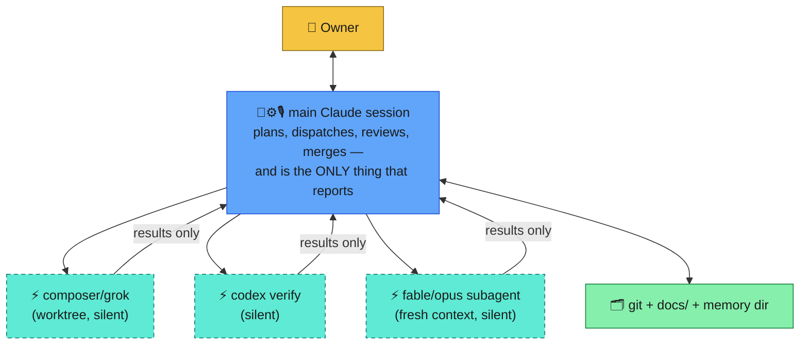

# Current state: voice skin per worker

What Room of Devs is **today**, drawn honestly (issue #73, deliverable 1).
Legend: [00-legend.md](00-legend.md).

The one-sentence truth: **every persona IS a heavy session.** Voice is a
skin stretched over each worker — Raph's voice exists because Raph's
session fired a Stop hook, not because anything in the room decided Raph
should speak. There is no orchestrator node anywhere in this picture.

## The three questions, answered for today

- **Who holds conversational state?** Each session holds its own; nothing
  holds the *room's*. "What did Raph decide?" is answerable only by waking
  Raph or tailing his transcript.
- **Who spends credits?** Every persona utterance = one heavy-session turn
  (the big cost) + one Gemini rewrite + one ElevenLabs synthesis. Voice
  cost scales with *worker count*, because voice is bolted to workers.
- **What dies when a session ends?** The persona's entire "mind." The
  voice was never a person — it was a skin on a context window that just
  got cleared.

## The uncomfortable mirror

The way this repo is actually *built* already uses the topology the
product lacks — one orchestrating session, silent delegates, one
synthesized report stream:

One voice, many hands. The 20-board design program assumed
voice-per-worker so hard it spent its energy on group calls and huddles —
theater for a topology we don't even use when doing real work.

## What already points the right way

- **The interpreter (Stage 1, live)** is the only component shaped like
  the target: it sits *above* the sessions, routes owner intent for ≈$0,
  and never wakes a heavy model to answer "pause" or "clear your queue."
  Stage 2 (`answer_from_context`) extends the same shape to Q&A.
- **live-tail** proves the daemon can narrate work it didn't do — the
  narration source is a transcript, not the speaker's own turn. A voice
  layer above an orchestrator needs exactly that ability.
- **team.sh + inject_prompt.sh** are already a dispatch surface: the room
  can start sessions and put words in them. That's the actuator an
  orchestrator needs; today only the owner (and the interpreter, for
  single injects) pulls those levers.

What's genuinely missing is one thing: **a node that owns the loop** —
holds the plan, decides who works next, and synthesizes what's worth
saying. Whether that node should *be* Mikey or sit *under* Mikey is the
next document.
