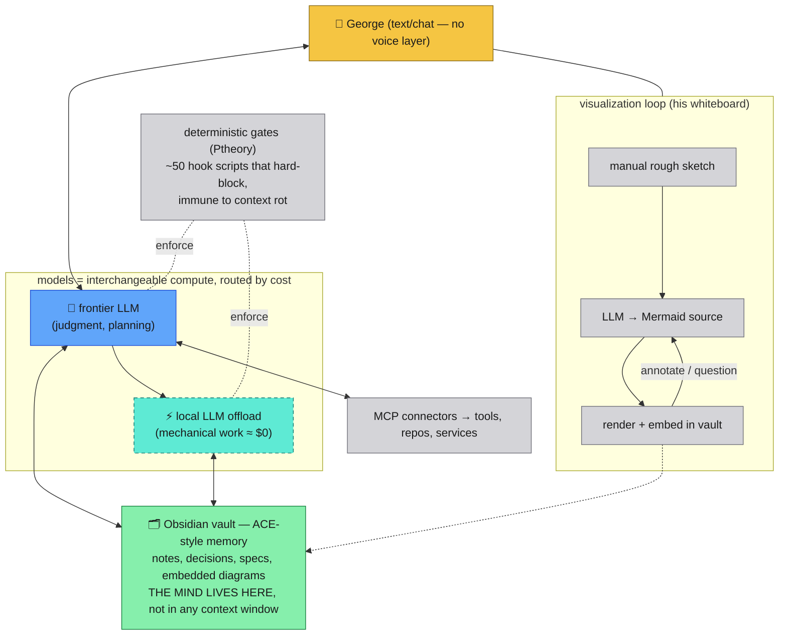

# George's framework, simplified

His stack, distilled to the same altitude as
[01-current-state.md](01-current-state.md) so the two can be compared
(issue #73, deliverable 2). Source: the framework exchange distilled in
[agentic-workflow-notes](../../reference/agentic-workflow-notes.md) plus
the stack summary in #73 — not a spec of his system, a sketch of its
load-bearing ideas.

## The three load-bearing properties

1. **Nothing important lives in a context window.** The vault is the
   mind; sessions are disposable compute over it. Any model can pick up
   where any other left off, and "session death" costs nothing. This is
   the property our Option A (Mikey-as-orchestrator) lacks and Option B
   is built on — see [03-candidate-layerings.md](03-candidate-layerings.md).
2. **Work is routed by cost.** Local models take the mechanical load;
   the frontier model is reserved for judgment. Our flash-lite
   interpreter and composer/grok delegation are the same instinct,
   already live.
3. **The whiteboard is a file loop, not ink.** Diagram = text artifact
   (Mermaid) that renders, gets annotated, and re-generates. Git/vault
   versions it. Identical to the over-the-shoulder board's
   "whiteboard as file + anchors, not ink" — and to what this very
   document set is doing.

## Same-altitude mapping

| George | Room of Devs |
| --- | --- |
| Obsidian vault / ACE memory | `docs/` + GH issues + `~/.cursor/tts/state` + git (exists, but the room's *plan* mostly still lives in session contexts) |
| Local LLM offload | flash-lite interpreter, composer/grok delegates (live) |
| MCP connectors | hooks, `team.sh`, `inject_prompt.sh`, file IPC (live) |
| Deterministic gates | promotion ladder in agentic-workflow-notes (partially adopted) |
| Manual-draw → Mermaid → embed loop | issue #73's artifact loop (this folder is the seed) |
| **no voice layer** | **the entire point of this product** |

The trade is symmetric: he has the mind-outside-the-model discipline and
no voice; we have the voice and (today) minds that die at `/clear`. The
target layering should steal his property 1 wholesale.
