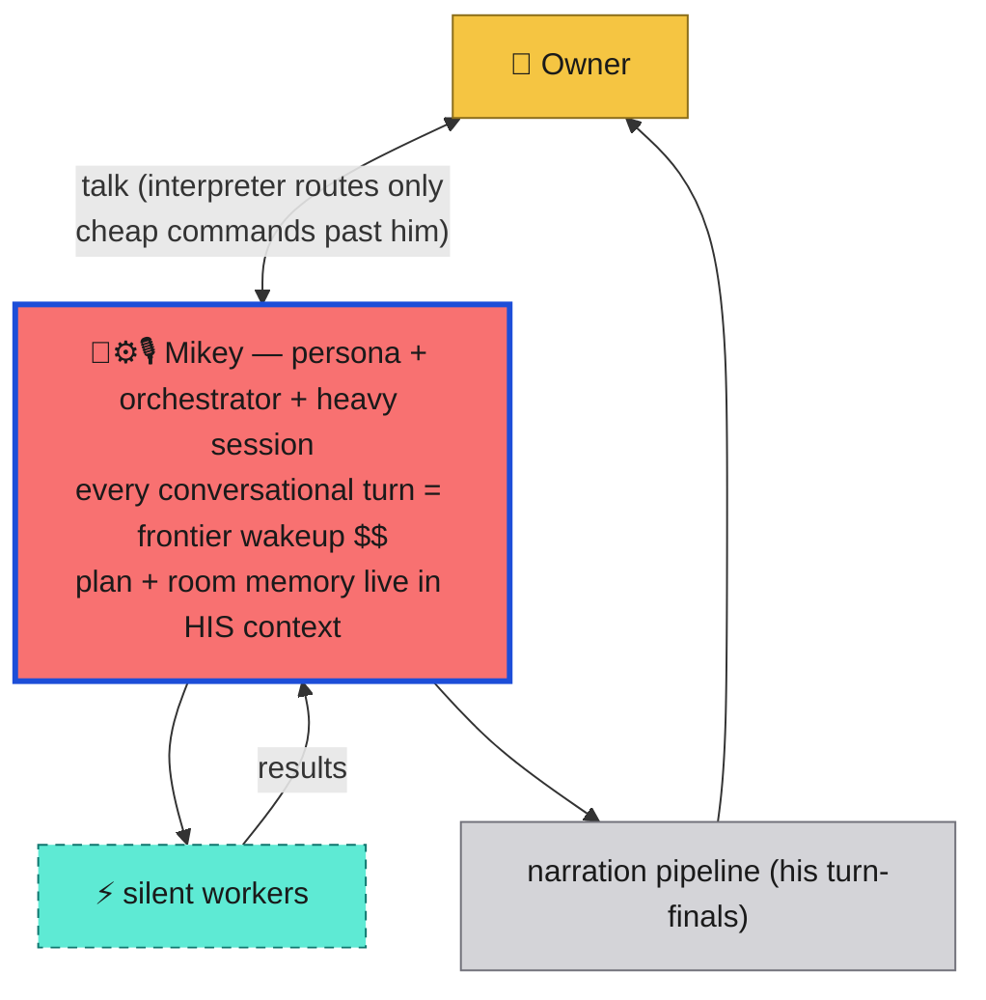
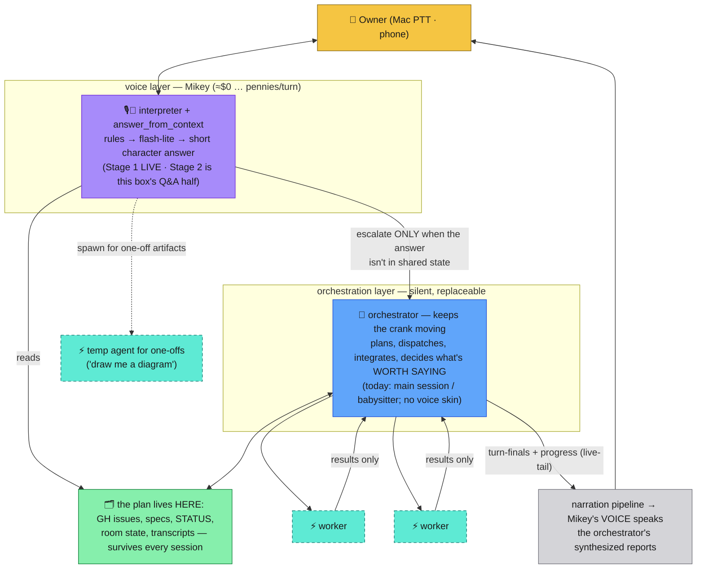
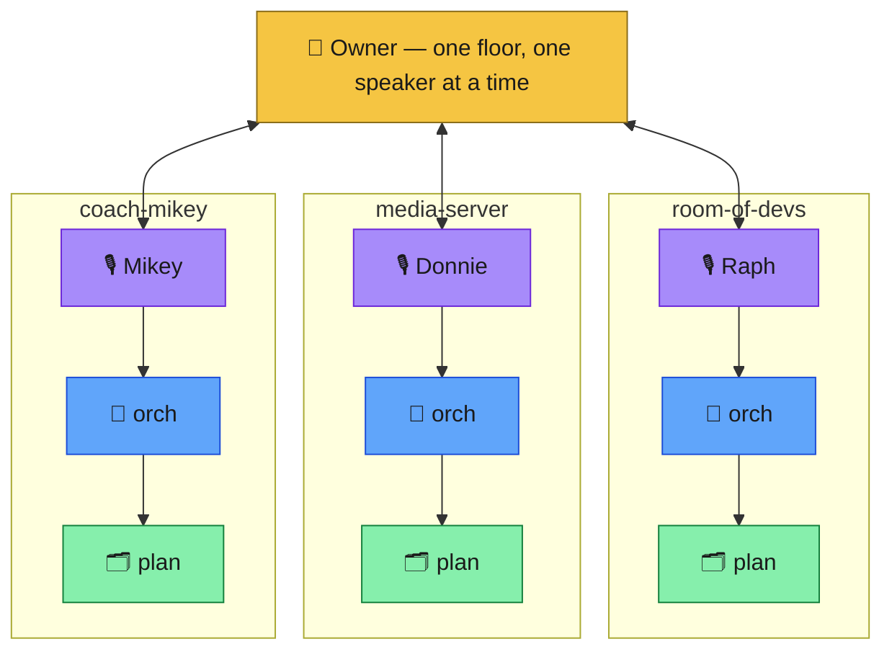

# Candidate layerings — and a recommendation

> **Amended:** owner feedback (2026-07-27/28) sharpened Option B — task
> manager as the spine, N mortal orchestration threads, voice checkout.
> The current canonical picture is
> [04-generalized-model.md](04-generalized-model.md); this doc remains
> the A/B/C decision record.

Issue #73, deliverable 3. Legend: [00-legend.md](00-legend.md). Each
option answers the three questions: who holds conversational state, who
spends credits, what dies when a session ends.

**Recommendation up front: Option B** — Mikey above a silent
orchestrator above ephemeral workers, with the plan living in files.
Option C is B's identity policy once a second project joins the room,
not a different architecture. Option A is rejected on evidence we
already own. Argument after the diagrams.

## Option A — Mikey IS the orchestrator

One heavy session wears all three hats: persona, orchestrator, worker
dispatcher. You talk to Mikey; Mikey plans, delegates, synthesizes, and
his own turn-finals are the narration.

- **State:** Mikey's context window. **Spend:** every question that
  isn't a canned command is a frontier wakeup billing his whole
  accumulated context. **Dies at session end:** the room's entire mind —
  plan, conversation, running jokes.
- **For it:** simplest possible story; zero relay staleness (the voice
  *knows* the plan first-hand); it's literally "the mirror" from
  01-current-state promoted to product.
- **Against it — empirically, not theoretically:** we already live with
  a talking orchestrator (the main session) and it is the documented
  cost driver: a 300–450k context across 13 wakeups burned ~25% of a
  weekly Fable budget in one day (CLAUDE.md, session token hygiene). A
  is that bill with a voice attached. It also makes chat and work
  contend for one single-threaded session — "where's that doc?" stalls
  the crank or queues behind it — and the hygiene rule that fixes cost
  (`/clear` early, `/clear` often) is exactly the operation that
  lobotomizes the persona.

## Option B — Mikey above a silent orchestrator (recommended)

Three tiers. The voice is a **layer**, not a resident: Mikey's "mind"
is the interpreter (rules → flash-lite) plus `answer_from_context` over
shared state. The orchestrator is silent, holds no precious state
(the plan lives in files: GH issues, specs, STATUS), and is woken only
for real orchestration. Workers are ephemeral and mute.

- **State:** files. The orchestrator holds only in-flight working
  context; Mikey holds a small interpreter turn log. **Spend:** voice
  turns are flash + TTS pennies; frontier wakeups only for actual
  orchestration or genuine escalation. **Dies at session end:** only
  in-flight work. The room's mind survives — George's property 1.
- **Existing machinery slots without hand-waving:** interpreter
  Stage 1 *is* the voice layer's command half (live today); Stage 2
  (`answer_from_context`, fact cache, tool-output projection — already
  specced) is its Q&A half; live-tail already narrates work the speaker
  didn't do, which is exactly a voice layer reading an orchestrator's
  progress; `team.sh`/`inject_prompt.sh` are the orchestrator's
  actuators; the hold-one buffer / provenance rules keep billing honest.
- **The honest costs:** (1) Mikey can only speak what's projected into
  shared state — a lazy orchestrator that keeps its plan in-context
  makes the voice a receptionist. The discipline "plan state goes to
  files" is load-bearing (it's also already our stated practice:
  autonomous crank = phases → GH issues). (2) Escalation needs a clear
  seam: flash answers from state; a short-lived frontier agent (fresh
  context, cheap wakeup) reads the same files for deep one-offs; waking
  the orchestrator is the *last* resort, not the second.

## Option C — one voice per project, a B-stack under each

Personas stop being per-session and become **project fronts**: Raph =
room-of-devs, Donnie = media-server, Mikey = coach-mikey — each fronting
its own (orchestrator + workers + plan files). One floor: whoever's
project you address holds it.

- This finally gives "Raph, Mikey, and Donnie in a room" a
  non-theatrical meaning: **they are parallel project fronts sharing
  your attention — they never talk to each other.** Cross-project
  "collaboration" is you, or a file handoff.
- It is architecturally identical to B — B instantiated N times with a
  routing rule ("hey Donnie" → media-server's stack). Adopt it as a
  *naming policy* the day a second project joins the room; nothing
  needs redesigning.

## Side by side

| | A: Mikey is the orchestrator | B: Mikey above silent orchestrator | C: voice per project |
| --- | --- | --- | --- |
| Conversational state | his context window | files + small turn log | files, per project |
| Credits per chat turn | frontier wakeup × full context $$ | flash + TTS pennies | same as B |
| One-off question mid-crank | stalls or queues behind the crank | answered beside it, loop untouched | same as B |
| Dies at `/clear` | the room's whole mind | in-flight work only | in-flight work only |
| Persona identity | one mortal mind | one durable voice over changing compute | durable, meaningful (project = character) |
| New machinery needed | none | Stage 2 Q&A + "plan lives in files" discipline | B + address routing |
| Fatal flaw | cost + mortality, already measured | discipline-dependent | premature until project #2 |

## Why B

The economic core of the conversational-layer design — *the win is not
free voice, it is not waking the coding agent* — is a decided consensus
(three-model review, 2026-07-21), and A's whole premise is waking the
coding agent to chat. We've paid A's bill once already; that datapoint
settles it. B is also the only option where every piece we've built
this month (interpreter, live-tail, command service, transcript
projections) lands in its final position rather than needing to move
again. And B degrades gracefully into today: with the orchestrator
being "the main session you drive by hand," B is just the interpreter
plus discipline — which is literally where we are, one Stage away.

**Round C re-cut, in one line:** the design target stops being "a room
of talking workers" and becomes "one voice you can always talk to
cheaply, a status surface for the silent work underneath it, and an
artifact loop for diagrams" — scenario flows in
[04-scenario-flows.md](04-scenario-flows.md).
