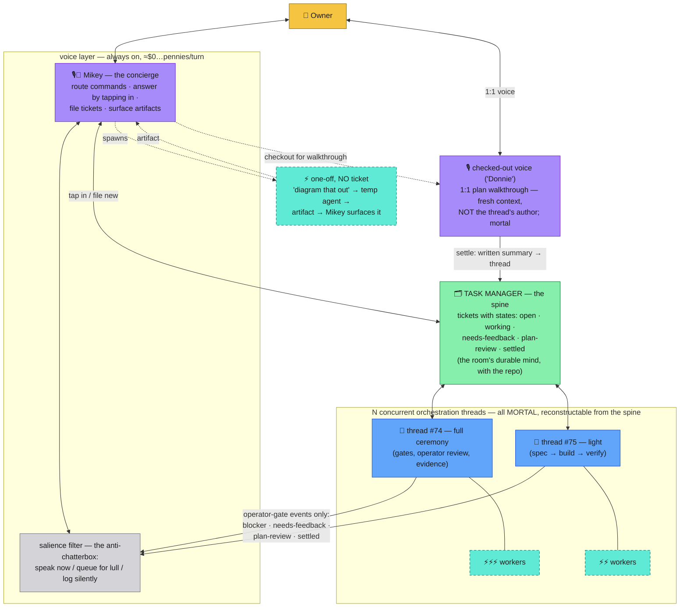
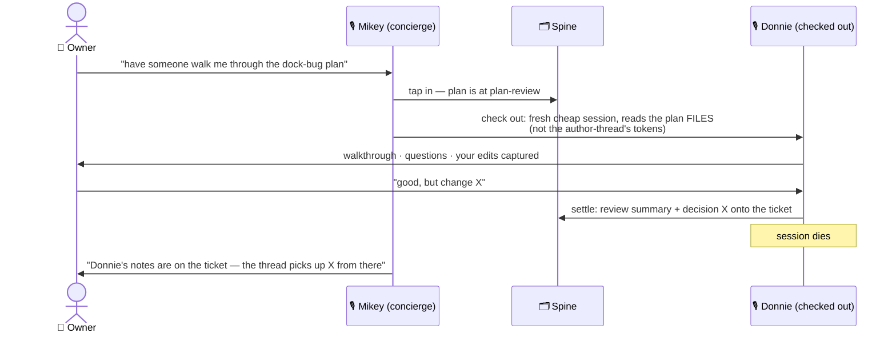
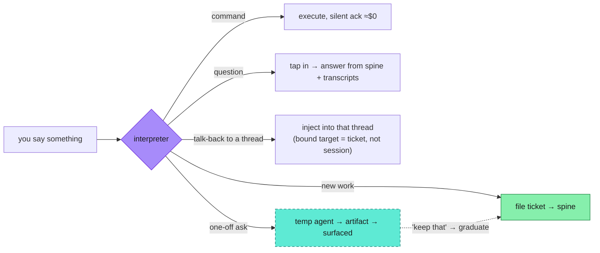

# The generalized model — B as amended by the owner

Owner feedback rounds, 2026-07-27/28 (sketch + brain dumps) folded into
[03's](03-candidate-layerings.md) Option B. This is the candidate
canonical picture. Legend: [00-legend.md](00-legend.md).

**One layering, two dials.** The layering is fixed: owner → one
always-on voice → interpreter line → task-manager spine → mortal
orchestration threads → silent workers. The dials:

1. **Ceremony per thread** — what runs *inside* an orchestration box:
   from bare one-off (no ticket) to light (spec → build → verify) to
   full Ptheory (gates, operator review, evidence bar). George's
   framework / our CLAUDE.md flow are ceremony configurations, not
   different architectures.
2. **Voice attachment** — who's speaking: Mikey (default, always), or a
   **checked-out 1:1 voice** borrowed for one purpose and settled after.

Every scenario from the brain dumps is a setting of those two dials.

## The settle rule (stolen from T3 Code, and it generalizes)

A thread's context is working capital, never savings. When a ticket
closes, the thread **settles**: conclusions are written back to the
spine (ticket comment / spec / STATUS), and the session is discarded —
never reused. This applies to *everything with a context window*:

| Thing | Settles when | Leaves behind |
| --- | --- | --- |
| Orchestration thread | ticket closed | ticket trail, commits, updated docs |
| Worker | task done | result to its thread |
| One-off temp agent | artifact delivered | the artifact (file, committed if kept) |
| Checked-out voice (Donnie) | walkthrough done | review summary + decisions on the thread |
| **Mikey** | **never** | — he's the only immortal, BECAUSE he's stateless: his "mind" is the spine + a small turn log |

Mikey survives every `/clear` in the building precisely because he
doesn't live in a context window. That's the Cortana property: she
tracks everything and speaks rarely — not because she's a giant brain
in the HUD, but because she surfaces from a war-room she can always
re-read.

## Tap-in, not play-by-play (the anti-chatterbox contract)

Mikey does not ack thread updates. Information flows two ways, both
bounded:

- **Pull — "where are we on the dock bug?"**: Mikey taps in — reads the
  ticket + the thread's transcript projection — and answers in
  character for pennies. The heavy thread never wakes.
- **Push — operator gates only**: a thread may speak through Mikey
  ONLY for the Operator-payload event classes: `blocker`,
  `needs-feedback`, `plan-review`, `settled/failed`. Progress milestones
  queue for the next lull; routine tool chatter is UI-only; subagent
  finishes are silent by policy (today's announce-leak bug, inverted
  into a rule).

## The checked-out voice (your "Donnie walks you through it")

Not ridiculous — it's the only version of multi-voice that isn't
theater, because the second voice is 1:1 with YOU, purposeful, and
mortal:

Three rules keep it cheap and honest: the walkthrough voice is **not**
the plan's author (fresh context reading files beats re-billing a fat
thread); it exists for one purpose and settles with a *written*
artifact; Mikey stays the point of contact before and after. Voices
never talk to each other — each voice only ever talks to you.

## The two flows (the generalization you were reaching for)

Everything either has a ticket or doesn't. That's the whole taxonomy:

- **Flow 1 — one-off**: no ticket, no ceremony, mortal by design.
  Commands, questions, "diagram this", quick concepting with a 1:1
  voice. If the output turns out to matter: "file it" graduates it into
  Flow 2.
- **Flow 2 — tracked thread**: ticket-backed orchestration at whatever
  ceremony gear the work deserves, fronted by Mikey, tap-in on demand,
  push on operator gates, optional voice checkout for reviews.

You don't need the full Ptheory framework for a one-off *because
one-offs are Flow 1* — ceremony is a property of threads, and Flow 1
has no thread.

## What this changes in 03

Option B stands; this sharpens it: the green box is explicitly the
task manager; the single orchestrator becomes N mortal threads pulled
from it; and the voice layer gains its real job description —
**salience, attribution, intake, and checkout** — which is exactly the
surface Round C should design.
