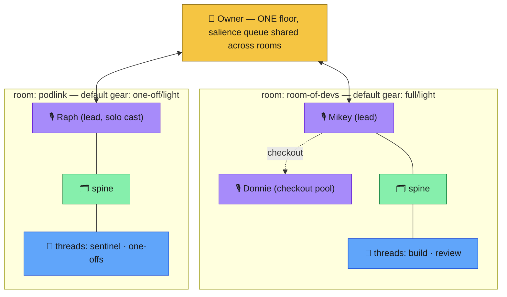
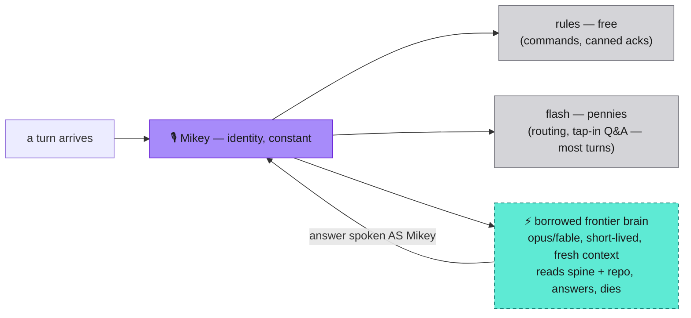
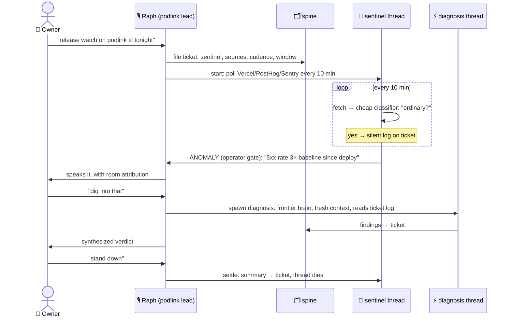

# Rooms, borrowed brains, sentinel threads

Owner feedback round 3 (2026-07-28) extending
[04-generalized-model.md](04-generalized-model.md). Three additions —
none change the layering; two add dials, one adds a thread type.

## Rooms — Option C arrives as configuration

A **room** = one project's space: repo(s) + spine + **cast** + default
ceremony gear. The cast is one lead voice (the concierge) plus
alternates who exist *only* for checkout — never simultaneous chatter.
One audio floor globally; the salience queue is shared across rooms
with room attribution.

Adopting rooms is **config, not architecture**: v1 builds ONE room
(this repo) with the room boundary as a config object — cast, spine
pointer, gear default. Podlink later = add a config entry.

## The third dial — brain tier per turn (persona ≠ model)

A persona is a voice + character + access to the spine — **not a set
of weights**. Mikey never "gets smarter"; he borrows brains:

"His own intelligence rooted in project context" is right — with the
sharpening that the context is **externalized** (spine, repo,
transcripts). That's why a fresh borrowed brain is instantly competent,
and why Mikey stays immortal and cheap. Durable cross-month "Mikey
remembers conclusions" is the ContextDB/room-memory line (conversational
layer Stage 6), behind the same identity.

Full dial set: **(1) ceremony per thread · (2) voice attachment ·
(3) brain tier per turn.** What runs in the box / who speaks / how
smart is this turn.

## Sentinel threads — the release-day watcher

A third thread type beside build/one-off: long-lived-but-mortal,
cheap, mostly silent, push-on-anomaly. Polling needs no big brain;
diagnosis borrows one on demand.

Thread-type roster so far: **build** (any ceremony gear), **one-off**
(no ticket), **sentinel** (watch + push on anomaly). Reviews/walkthroughs
are build-thread stages plus voice checkout, not their own type.
