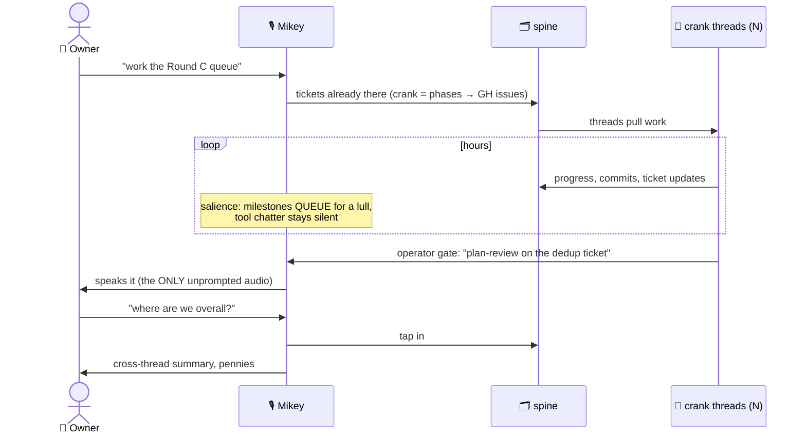
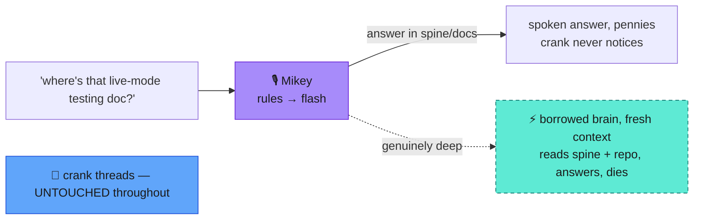
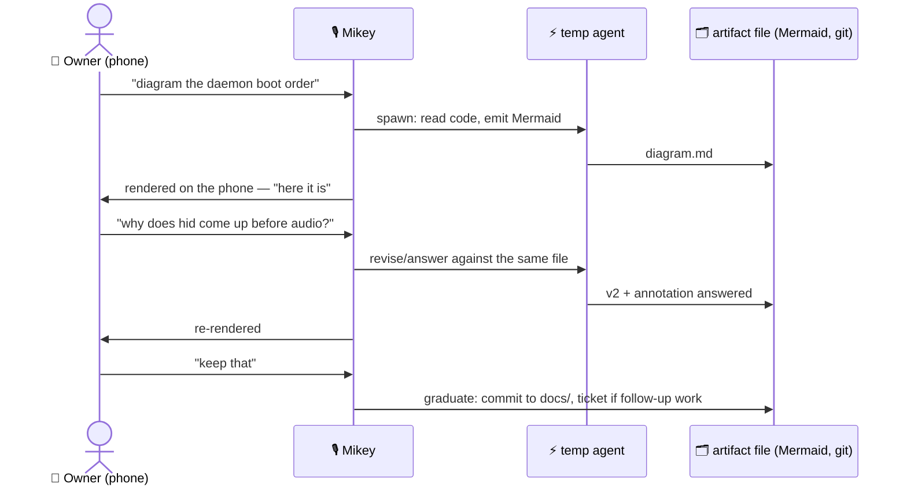
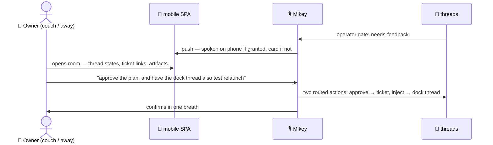

# Scenario flows — the load-bearing five

Issue #73, deliverable 4. Each scenario drawn against the picked model
([04](04-generalized-model.md) + [05](05-rooms-brains-sentinels.md)),
with the existing machinery named — the validation bar is "slots
without hand-waving."

## 1 — Long crank loop with progress narration

Existing machinery: the autonomous-crank practice (phases → GH issues)
is already the spine discipline; live-tail is the progress feed;
the Stop-hook path is the turn-final feed; the salience filter is the
new piece (today everything a session says gets announced — the filter
is what Round C's UI must surface and control).

## 2 — One-off question mid-crank (the loop must not stall)

The whole point of the layering: the question rides the voice layer;
the heavy threads are never woken, never stalled. Machinery:
interpreter Stage 1 (live) + Stage 2 `answer_from_context` (specced) +
the brain-tier dial for the deep tail.

## 3 — "Draw me a diagram" (the artifact loop, not ink)

The whiteboard is a **file loop**: text artifact, versioned, re-rendered
— George's manual-draw→Mermaid→embed loop and the over-the-shoulder
board's "whiteboard as file + anchors, not ink," converged. Machinery:
this issue built the rendering path (docs-publish mermaid→SVG); the
temp-agent spawn is the Agent-tool pattern the repo uses daily.

## 4 — Supervision from the phone

Machinery: mobile SPA + SSE + `/thread` (live), typed replies (live),
speaker-gate/grant flow (live), hold-to-talk phone mic = conversational
layer Stage 4 (designed). The re-cut changes what the phone SHOWS
(threads/tickets, not per-session cards) more than how it transports.

## 5 — Anti-scenario: the three-voice huddle

What the 20 boards kept designing, priced honestly against what the
model delivers with one voice:

| | 3-voice huddle, one "round" | one-voice relay |
| --- | --- | --- |
| Heavy sessions awake | 3 (all billing full context) | 0–1 (orchestrator synthesizes) |
| Gemini rewrites | 3 | 1 |
| ElevenLabs syntheses | 3 (the cash cost ×3) | 1 |
| Floor/turn machinery | new subsystem (hand-raise, cross-talk, moderation — unspecified in ALL four final boards) | exists today |
| Owner's role | moderator of theater | recipient of a synthesized, attributed report |
| Information delivered | the same disagreement, slower, in character | the disagreement, cited ("Raph's review flagged X; the build thread disagrees because Y") |

Real disagreement between two threads is **content, not theater**: the
orchestrator (or a review thread) writes both positions to the ticket;
Mikey speaks the conflict and takes your ruling. The final-4 re-review
flagged huddle synthesis cost as hand-waved in every board — this is
the answer: don't synthesize a meeting, synthesize a memo.
