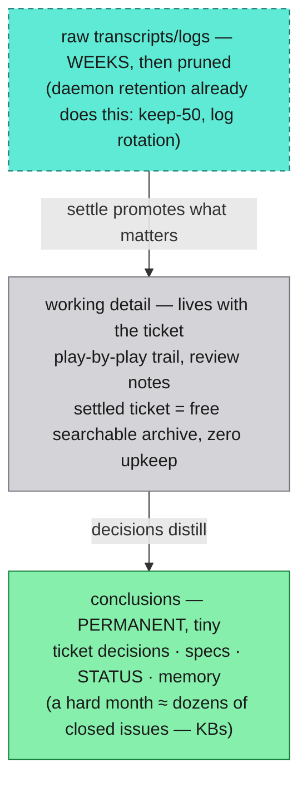

# Spine mechanics — write-back, retention, and where ContextDB fits

Owner + George Q&A round (2026-07-28). Answers "what exactly is the
spine, won't it drown us in logs, and is this where ContextDB comes in."

## What the spine is

The record everything else can be rebuilt from — the room's state kept
**outside every context window**. Three layers, different jobs:

| Layer | Holds | Examples |
| --- | --- | --- |
| **Tracker** (GH issues) | work state — the index | tickets, states, decisions per ticket |
| **Repo** (code + docs/) | knowledge state — the body | specs, STATUS, this folder |
| **Transcripts + runtime state** | raw history | session JSONLs, `~/.cursor/tts/` state, hook logs |

The rule that makes it a spine and not "some files": **nothing
important may live only in a context window, and every thread writes
its conclusions back before it dies.** Sessions are cache; the spine is
storage.

## Write-back is not logging

The settle rule writes **conclusions, keyed by ticket** — the decision,
what shipped, what was learned, commit pointers. The ticket is the join
key; a transcript is "the raw history of ticket #74's thread,"
discoverable but never the record. The write-back moment IS the
summarization step: done by the thread that has full context, at settle
time, for free. No scheduled log→summary pipelines — that's what teams
build when they *lack* a settle discipline, and then they drown.

## Retention pyramid

Short retention at the bottom is safe because of the promotion rule:
**if a fact still matters when the transcript ages out, settle should
have promoted it.** Losing an old transcript only ever loses what
nobody concluded.

## Storage: deliberately dumb

Plain markdown + git + GH issues — greppable, diffable, writable by any
agent from any worktree via `gh`. Obsidian is George's skin over the
same idea (a markdown vault); our vault is `docs/` + the tracker. **A
vector store is not a spine** — it's a retrieval layer *over* one, and
confusing the two puts your source of truth inside an unauditable
embedding index.

## The ContextDB slot

Yes — this is exactly where it comes in, and it's already reserved
(conversational-layer design, Stage 6). Trigger: cross-session recall
starts failing on **wording divergence** ("the runaway dock thing" vs
"NSPanel repositioning regression") — grep and flash tap-in stop being
enough. ContextDB then ingests *conclusions* as a **rebuildable derived
index** (credibility/decay/evidence chains fit "the room remembers
conclusions"); tickets and transcripts stay source of truth; if the
index corrupts, rebuild it from the spine and lose nothing. Two gates:
the measured trigger actually firing, and the known upstream bug
(refutes not affecting vector-path ranking) reported/fixed first.

## Validation status — half proven, and the next work item

**Proven by practice** (as a work surface): Rounds A/B executed from
issues by fresh sessions; #73 itself ran from an issue + kickoff
comment; delegates read/write via `gh` from worktrees.

**Unproven** (as a queryable state store for the voice layer):

1. Ticket states (`needs-feedback`, `plan-review`, …) aren't
   machine-readable labels yet — they're prose.
2. The tap-in bet is untested: can a flash-tier reader produce a good
   "where are we?" from `gh issue list` + transcripts alone?
3. Write-back freshness: threads currently write at round ends, not
   continuously — a mid-flight tap-in today finds stale state.

**The spine validation experiment** (cheap, contained, gates tap-in
and watcher threads): define the state labels; run a flash-tier
summarize of the live room from tracker output; grade its answers
against ground truth; tighten write-back cadence if that's where it
fails. This is the first concrete build item #73 produced.
