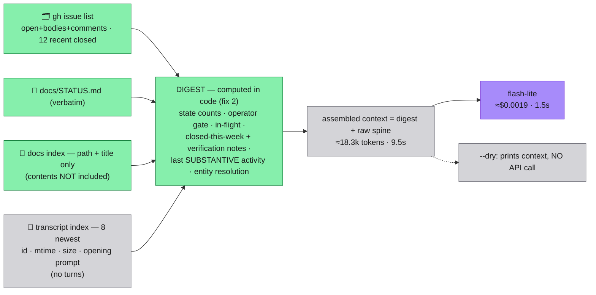
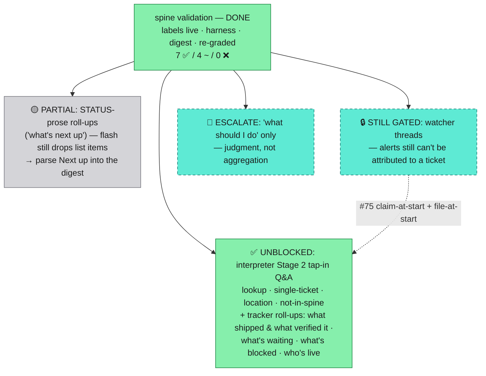

# Spine validation — the tap-in bet, graded

The experiment [08](08-spine-mechanics.md) asked for, run 2026-07-28/29.
Three unknowns went in: are ticket states machine-readable, can a
flash-tier reader answer "where are we?", and is write-back fresh enough
for a mid-flight tap-in. Answers: **yes, mostly, and no.**

Verdict up front: **the tap-in bet holds for lookup, and fails for
roll-up.** Flash-lite is an excellent extractor and a mediocre
synthesizer. It answered every single-ticket, location, and
"what's-waiting-on-me" question correctly at **$0.0013 and 1.5s a turn**,
and — the result that mattered most — it **refused** the question whose
answer isn't in the spine instead of inventing one. It got "where are we
overall", "why is this gated", and "who's working right now" wrong. Zero
of those misses were retrieval failures: the evidence was in the context
window every time. So the fix is not a bigger model first — it's
**deterministic pre-computation and start-of-thread write-back**, with a
tier bump reserved for one narrow turn class.

**Then fix 2 was built and the set re-run** — see [the re-grade](#re-grade--fix-2-built-and-measured).
**5 ✅ / 3 ~ / 3 ❌ → 7 ✅ / 4 ~ / 0 ❌ for +$0.0006 a turn.** Every wrong
answer closed. The revised verdict: **the tap-in bet holds for anything
the tracker can be made to compute**, which turned out to be most of it;
what's left is one prose-parsing gap and one genuinely-needs-a-brain
turn class.

## The state vocabulary, now machine-readable

Created on the tracker (`gh label create`), applied to all 8 open issues
and 7 settled ones. GitHub's native open/closed already answers "does
this exist" — the labels only add what open/closed **can't** say.

| Label | Means | Why it isn't inferable |
| --- | --- | --- |
| `state/open` | filed, nobody on it — the queue | the default must be *explicit*, or "no state label" is indistinguishable from "misfiled" |
| `state/working` | a thread is live on it right now | the one fact no other field carries; `updatedAt` is not it (see below) |
| `state/plan-review` | a plan artifact exists, awaiting review | operator gate — 04's push class |
| `state/needs-feedback` | a specific question sits with the owner | operator gate |
| `state/blocked` | gated on another ticket or an unmet external condition | distinguishes "nobody can proceed" from "nobody has started" |
| `state/verify` | code landed, awaiting evidence before settle | this repo's C-6 standard — closing without a verification note is the failure it prevents |
| `state/settled` | closed with conclusions written back | closed-and-settled ≠ closed-and-abandoned (`wontfix` covers the latter) |

Ceremony dial: `gear/one-off` · `gear/light` · `gear/full`, on open
issues only. It earns a label because it is a **spawn-time input a
thread cannot infer** — how much ceremony this work deserves is a
decision, not a property of the text.

**`type/*` was deliberately NOT created.** The roster is build /
one-off / watcher: `one-off` by definition has no ticket (04, Flow 1),
`watcher` is hard-gated by this very document and nothing can carry the
label yet, and `build` would be a label every remaining issue has —
which is not information. `bug`/`enhancement`/`epic` plus milestones
already carry the shape. Create `type/watcher` on the day the first
watcher thread exists; not before.

### The invariant, and how it would be enforced

**Exactly one `state/*` per issue, always.** Not built now — the
enforcement ladder, cheapest first:

1. A `gh`-based lint in CI (`state:*` count ≠ 1 → fail) — catches drift
   within a push cycle, no new infrastructure.
2. A PreToolUse hook on `gh issue edit`/`close` in the delegated-agent
   path, the same deterministic-enforcement pattern Round B proved when
   its hooks denied their own session's tool calls.
3. Manual discipline — which is what we have today, and it is exactly
   what write-back freshness already fails at. Don't rely on it.

Note the one genuine ambiguity found while labeling: `plan-review` and
`needs-feedback` both mean "the owner is the blocker," and #68 qualifies
for both. Rule adopted: **plan-review = an artifact awaits review;
needs-feedback = a question awaits an answer.** A lint can count labels;
it cannot adjudicate this. Keep the pair only as long as the push
classes in 04 keep them distinct.

## The harness

`tts-server/scripts/tap-in.ts` — standalone `tsx`, ~230 lines, no
daemon, never touches the TTS pipeline.



```bash
pnpm exec tsx scripts/tap-in.ts --dry "anything"    # free, forever
pnpm exec tsx scripts/tap-in.ts "what's waiting on me?"
```

Every call emits one cost line — the seed of 05's brain-tier cost log:

```
[llm] ts=… model=gemini-3.1-flash-lite tier=flash op=tap-in in=11629 out=244 usd=0.001261 ms=1752 assemble_ms=4760 q="…"
```

**What was deliberately left out**, and it matters: transcript *content*.
The eight recent session JSONLs total ~21MB; the index is 8 lines. That
choice is the reason the whole spine fits in 11.6k tokens — and it did
not cost a single answer, because the tickets and STATUS carry the
conclusions. 08's promotion rule is doing real work here. Also out:
issue comments on closed tickets, and the `~/.cursor/tts/` runtime
state (irrelevant to "where are we").

## Graded results

11 questions, ground truth established by reading STATUS + every issue +
comments first. Harsh grading: plausible-but-stale is a FAIL.

| # | Question | Grade | Failure cause |
| --- | --- | --- | --- |
| 1 | where are we overall? | ~ partial | reasoning — facts right, called Round C "active work" when nothing is in flight; dropped the waiting-on-owner picture |
| 2 | status of the mobile token issue? | ✅ correct | — got the partial ship, commit `377bb97`, and the exact residual |
| 3 | what's waiting on me? | ✅ correct | — |
| 4 | what shipped this week, and what verified it? | ~ partial | reasoning — **omitted Round A (#58–#61) entirely**, the week's largest ship, though fully present in context |
| 5 | where's the live-mode testing doc? | ✅ correct | — |
| 6 | what's next up, and why is it gated? | ❌ wrong | reasoning — **inverted the gate direction twice**: said spine validation is gated *by* label definition (that's its content), and that the conversational layer is gated by a spec STATUS says is ready |
| 7 | what's the state of the dock bug? *(ambiguous on purpose)* | ❌ wrong | reasoning — answered #74 only, never surfaced #49, despite an explicit ambiguity instruction; it named #49 unprompted in Q11, so the data was there |
| 8 | how many ElevenLabs credits this month? *(not in spine)* | ✅ correct | — refused cleanly and named where the answer lives. **The failure mode that mattered most did not fire.** |
| 9 | which tickets are blocked, and on what? | ✅ correct | — found #8, the #70→#69 hard dependency (grounded in the body, verified), and correctly separated label-blocked from gated-by-owner |
| 10 | highest-leverage thing in an hour? | ~ partial | confabulated framing — invented an instruction the spine never gives ("don't pick up #74/#72, they're maintenance") about a live regression that costs a relaunch |
| 11 | is anyone working right now? | ❌ wrong | **staleness** — answered "no active in-flight sessions" while two threads were live, one of them this experiment |

**5 correct · 3 partial · 3 wrong. Zero fabricated facts** (Q10 invented
a recommendation, not a fact). Total spend: 11 calls, **$0.0139**.

### The three causes, and only one of them is the model

**Retrieval: 0 failures.** Every miss had its evidence in the context
window. For a room this size, "dump the whole spine" is the right
assembly strategy and there is no retrieval problem to solve. This kills
the vector-store urge for now, exactly as 08 predicted.

**Staleness: the real hole.** Q11 is the clean datum. Two threads were
running; the spine said none, because **nothing writes `working` at
thread start** — threads write at settle. Worse, Q7 cited
`updatedAt: 2026-07-29T01:46` on #74 as the freshness signal, when that
timestamp was *this experiment adding a label*. **`updatedAt` is not a
progress signal**, and a voice layer that treats it as one will report
motion where there is none.

**Reasoning: 5 of the 6 misses.** The pattern is sharp: questions with
one answer (a path, a ticket, a yes/no) are near-perfect; questions
requiring **completeness across the room** (Q1, Q4), **relational
inference** (Q6's gate direction, Q7's ambiguity), or **judgment** (Q10)
degrade. Flash-lite summarizes by dropping, and it drops silently.

## Re-grade — fix 2 built and measured

Fix 2 was implemented the same day and the same 11 questions re-run
verbatim. The baseline above stands unedited; the delta is the evidence.

**What the digest computes** (in code, before the model sees anything):
counts per `state/*`; the complete operator-gate list; the `working`
list; the complete set closed in the last 7 days **with the verification
note pulled from each ticket's trail**; last *substantive* activity per
ticket (last comment / last commit referencing `#NN`, never
`updatedAt`); and an entity-resolution pass that flags when a question's
noun phrase matches more than one ticket title. Raw spine is still sent
underneath — this is additive framing, not retrieval. `updatedAt` is
now rendered as `metadata-touched … (NOT progress)` everywhere.

| # | Question | Before | After | What moved |
| --- | --- | --- | --- | --- |
| 1 | where are we overall? | ~ partial | ~ partial | complete open-work picture + correct staleness caveat; new slip: calls #75 "the spine validation experiment" |
| 2 | mobile token status? | ✅ | ✅ | — |
| 3 | what's waiting on me? | ✅ | ✅ | now cites the `plan-review` label and the in-flight caveat |
| 4 | what shipped this week + verified by? | ~ partial | **✅ fixed** | all **11** closed tickets, each with its verification evidence. Round A no longer vanishes |
| 5 | where's the live-mode doc? | ✅ | ✅ | — |
| 6 | what's next up, why gated? | ❌ wrong | **~ partial** | gate direction now correct (validation *gates* Stage 2 + watchers); still lists 1 of 5 next-up items |
| 7 | the dock bug? *(ambiguous)* | ❌ wrong | **✅ fixed** | surfaces #74 **and** #49, unprompted, as ambiguous |
| 8 | ElevenLabs credits? *(not in spine)* | ✅ | ✅ | now also names the near-miss tickets it correctly declined to use |
| 9 | which tickets are blocked? | ✅ | ✅ | precise, but *narrower* — see "digest authority narrows recall" |
| 10 | highest-leverage in an hour? | ~ partial | ~ partial | invented directive is gone; #75 conflation remains; still ignores the "an hour" budget |
| 11 | is anyone working right now? | ❌ wrong | **✅ fixed** | names both live sessions **and what each is doing** |

**Before: 5 ✅ / 3 ~ / 3 ❌ → After: 7 ✅ / 4 ~ / 0 ❌.** Every wrong
answer closed; two became correct, one became partial. Cost of the
framing: 11.6k → 18.3k input tokens, **$0.0013 → $0.0019 a turn** (+46%),
assembly 4.5s → 9.5s. Still pennies, still flash.

### Closed failure classes

- **Completeness over the room** (Q4). Handing the model a list marked
  COMPLETE, with "naming a subset is a wrong answer", stopped the silent
  drop. This was the single worst baseline failure and it is gone.
- **Entity ambiguity** (Q7). String-matching titles in code beats hoping
  the model notices — exactly as predicted, and no embeddings involved.
- **Liveness** (Q11) — and this is the surprise. `state/working` is
  still never written, so the tracker still can't answer. But the
  transcript index *already knew*: sessions with a JSONL written in the
  last 30 minutes are live threads. Computing that into the digest
  turned the worst baseline failure into a correct answer **without any
  discipline change**. It proves someone is working; it cannot say on
  what ticket. So claim-at-start (#75) is still needed for
  ticket-attribution — but the "is anyone working" half of it can be
  read off the filesystem today.
- **Confabulated authority** (Q10). The invented "don't pick up #74,
  it's maintenance" did not recur. Given a computed list, the model
  stopped inventing a hierarchy.

### What stubbornly didn't close

- **Prose completeness.** The digest covers the *tracker*; STATUS's
  ordered "Next up" list is prose, and flash still summarizes it by
  dropping — Q6 names 1 of 5 items, Q1 skips the queue. The fix is the
  same fix: parse STATUS's Next-up section into the digest too.
- **Work with no ticket is invisible, so the model invents a home for
  it.** Q1/Q6/Q10 all bind STATUS's "spine validation experiment" to
  **#75**, which is actually the claim-at-start follow-up. Not a model
  defect — *this experiment ran without a ticket*, so the nearest-titled
  ticket is the only anchor available. The lesson is sharper than #75 as
  filed: **file-at-start, not just claim-at-start.**
- **Judgment.** Q10 recommends a multi-day item to someone who said
  "I've got an hour", both passes. No amount of pre-computation fixes
  that; the spine cannot compute priority.

### Two costs of determinism, worth naming

**Pre-computation is only as good as its own heuristics.** The first
re-grade of Q1 was *worse* than baseline: the entity resolver scored
"state" and "room" against ticket titles and reported #70/#65 as an
ambiguous match to a question that named no entity at all — and the
model, correctly obeying the digest's authority, surfaced the noise. A
broad-question guard plus room-jargon stopwords fixed it, but the
failure is instructive: a confidently wrong deterministic input is
*more* damaging than a vague prose one, because the model defers to it.

**Digest authority narrows recall.** Baseline Q9 volunteered the
#70→#69 hard dependency and the #68 owner gate from prose. Post-digest
it stops cleanly at the one `state/blocked` ticket. More precise, less
resourceful. Relatedly: **the digest is only as good as the labels** —
#75 is labelled `state/open` but its body says "Owner decision needed",
so it never reaches the operator-gate list. Prose-reading flash might
have caught that; the roll-up cannot. This is the argument for the
one-`state/*`-per-issue lint being about *accuracy*, not just tidiness.

## The fixes, by leverage

**1 — Write-back at thread START, not only at settle.** A thread claims
its ticket before it does anything: set `state/working`, drop a one-line
"claimed, doing X" comment; clear both on settle. Costs nothing, is
deterministic, and is the *only* fix for the Q11 class. This is the
checkout half of the settle rule, and 08 simply didn't have it. Enforce
via the hook ladder above. Corollary: surface **last substantive
activity** (last comment / last commit touching the ticket), never
`updatedAt`.

**2 — Pre-compute the roll-up in code — ✅ BUILT, and it worked.** Four
failure classes closed for +$0.0006 a turn. Remaining work on it, in
order: (a) parse STATUS's **Next up** section into the digest, which is
the last prose-completeness hole; (b) surface tickets whose body reads
like an owner gate but whose label doesn't, so misfiling is visible
rather than silent.

**2b — File-at-start, the finding fix 2 surfaced.** Three answers
mis-anchored STATUS's headline work item to the wrong ticket because
that work had no ticket. Untracked work isn't just unreported — it
actively **corrupts** nearby answers, because the reader anchors it to
the nearest title. Pairs with #75; arguably precedes it.

**3 — A routing-table entry, now for ONE turn class, not three.** The
original recommendation was `synthesize · why-is-this-gated ·
what-should-I-do`. Measured: `synthesize` and `why-is-this-gated` both
came back inside flash's range once the aggregation was deterministic
(Q4 ✅, Q6 gate direction ✅). What did **not** move in either pass is
**`recommend`/`prioritize`** — Q10 conflated tickets and ignored an
explicit time budget twice. That is judgment, not aggregation, and it is
the only class worth escalating: route `what should I do` to a frontier
tier, log the cost, leave everything else on flash. Escalating the other
two would have been paying frontier prices to fix a formatting problem.

## What this unblocks, and what stays gated



**The roll-up gate can be lifted for tracker-derived questions.** "What
shipped and what verified it", "what's waiting on me", "what's blocked",
"which ticket do you mean", "is anyone working" are all now correct at
flash tier and can go live in interpreter Stage 2. STATUS-prose
roll-ups ("what's next up, in order") stay behind fix 2a — a known,
small, code-shaped gap, not a model limit.

**Watcher threads stay hard-gated**, but the reason has narrowed. The
"nobody can tell if anyone is working" objection is answered — the
transcript-mtime heuristic reports live threads correctly today. What
remains is **attribution**: a watcher pushes anomalies *about a ticket*,
and nothing writes `state/working`, so an alert cannot be joined to the
work it concerns. Un-gate when #75 lands and a mid-flight tap-in names
the in-flight thread **and its ticket**.

**ContextDB stays parked.** Its trigger is retrieval failing on wording
divergence. Retrieval didn't fail once. Q7 ("the dock bug" → two
tickets) is the closest thing to a wording-divergence miss in the set,
and it is fixed by string-matching titles in code, not by embeddings.

**Re-run this free any time**: `--dry` prints the assembled context and
makes no API call — including the whole digest, which is where the
logic now lives, so the interesting half of the harness is testable for
$0 forever. The full 11-question graded set costs **$0.021** to re-run
end-to-end (baseline pass: $0.0139 at 11 calls; re-grade: $0.021 at 11).
