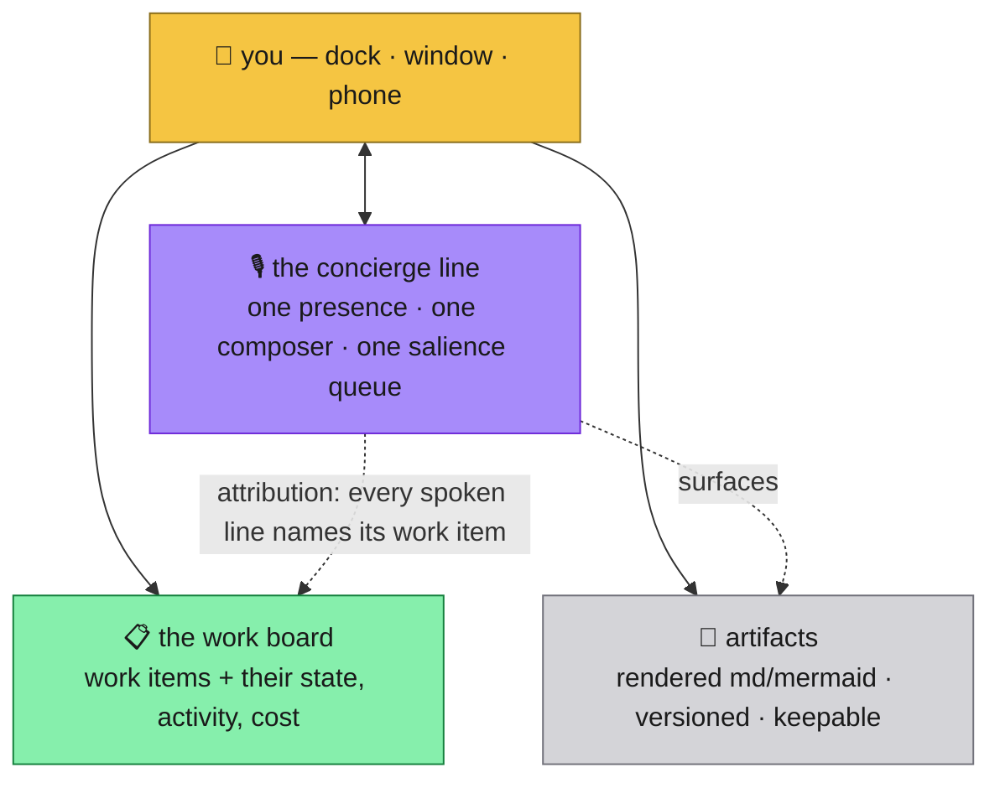
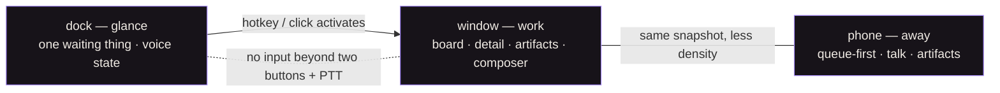
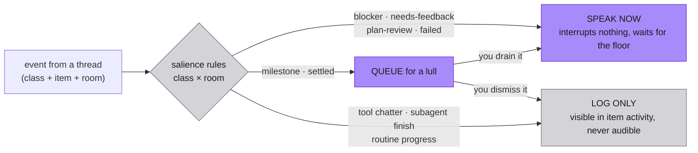
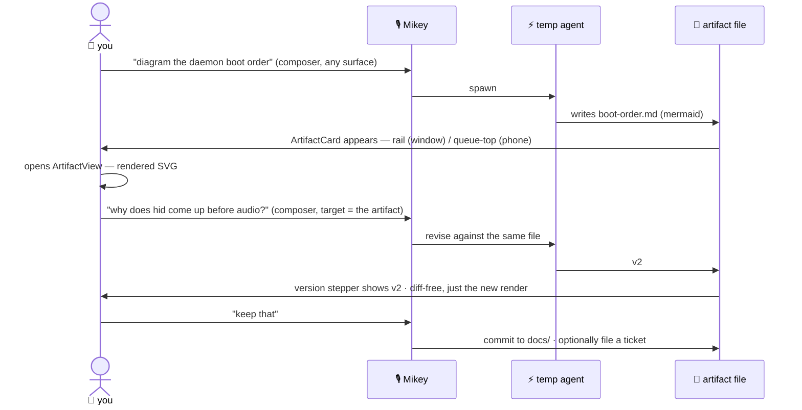

# Candidate A — "Work Item"

> **Status: a CANDIDATE, not the target.** This was written and briefly
> locked on 2026-07-28; the owner correctly pointed out that locking an
> exact target *before* a concept round makes every board the same board.
> So its **constraints** were extracted into
> [design-brief-round-c.md](../design-brief-round-c.md) (those still
> bind), and its **design proposals** — layout, IA, the spend readout's
> shape, the dock's states, palette — now compete as one entry in the
> concept round. Sections 1, 6-invariants, and 7 are largely brief
> material; sections 2–5 are this candidate's actual design opinion.
>
> Its distinguishing bet: **the work item is the primary object**, the
> concierge is chrome, and cost is a first-class readout.

Written 2026-07-28, after #73 closed and picked the layering in
[architecture-concepts/04](architecture-concepts/04-generalized-model.md)
+ [05](architecture-concepts/05-rooms-brains-sentinels.md).

This supersedes the premise of all 20 design boards. They were drawn for
"a room of talking workers." That product is cancelled. What follows
takes their parts and throws away their skeleton — the reasoning is in
[§7](#7-what-the-boards-gave-us-and-what-we-threw-away).

---

## 1. The re-cut in one page

**Old:** N agents, each a card, each a voice, each talking to you. The UI's
job was managing a crowd.

**New:** one voice, always available, cheap. Under it, silent work tracked
in tickets. Beside it, artifacts you can read.

The UI has exactly three jobs:

1. **Talk to Mikey** — from any surface, by voice or by typing, with
   attachments, for pennies. This is the only conversational surface in
   the product.
2. **See what's true underneath without asking** — which work items exist,
   what state they're in, which one wants you, what it cost. A status
   surface for silent threads.
3. **Receive, question, and keep artifacts** — a rendered diagram or doc
   arrives, you ask about it, a new version arrives, you keep it.

Plus one genuinely new control, which is the reason this round exists:
**the salience surface** ([§4](#4-the-salience-surface)) — what gets
spoken now, what waits for a lull, what is only ever logged. Today every
Stop hook becomes speech. That default is the thing the re-cut kills.



### What the UI is explicitly NOT

Anti-goals from
[07-not-building.md](architecture-concepts/07-not-building.md), restated
so a design can be checked against them by looking at a screen:

| # | Anti-goal | UI-checkable test |
| --- | --- | --- |
| 1 | Not a voice+KB chatbot | The conversation surface is never the whole app. Work state is visible without asking anyone. |
| 2 | No multi-voice theater | **At most two avatars on screen ever** (Mikey + one checked-out voice). No speaker queue, no floor, no huddle, no hand-raise. Disagreement renders as text on a work item, never as two voices. |
| 3 | No real-time ink | No canvas, no strokes, no stroke timing, no scrub-synced replay. Artifacts are files with versions. |
| 4 | No lipsync escalation | Lipsync stays the cosmetic rAF loop on the one presence. It never drives layout, ink, or "presence" logic. |
| 5 | No always-listening mic | Every mic capture starts with a deliberate press. No VAD, no wake word, no open-by-default duplex. |
| 6 | No resident orchestrator brain | Nothing in the UI implies a long-lived "mind" you can talk to about anything. Mikey's answers cite the spine. |
| 7 | No new orchestrator runtime | No kanban board with drag-to-transition, no process designer. The board mirrors the tracker; it does not become one. |
| 8 | No conversation state in clients | Every pixel derives from the daemon snapshot. Clients hold view state (what's open, scroll) and nothing else. No client-side message list, no optimistic dialogue. |
| 9 | No database for room state | Nothing in the UI needs a query language. If a view needs an index the filesystem can't serve, that's a design bug. |
| 10 | No silent capability growth | Any "save that as a tool" is a visible, named, confirmable action. |

**One more, added here:** no global scrubbable tape. See
[§7](#7-what-the-boards-gave-us-and-what-we-threw-away).

---

## 2. Information architecture per surface

### The primary object: the work item

> **A work item is a unit of tracked work: a ticket, its current thread,
> its activity, its artifacts, and its cost.**

The old primary object was the session card — a persona bound to a tmux
session. That object is dead because it is keyed to a context window, and
in the new model every context window is mortal. A UI whose primary noun
dies at `/clear` re-creates the exact failure #73 rejected.

The work item is the right noun because it is **the spine's own noun**:
it survives thread death, it carries machine-readable state, it is the
join key for transcripts, artifacts, commits and spend, and it is what you
actually steer ("approve the plan", "kill that", "what's blocked").
Personas are demoted to an attribute — *which voice fronts this room* —
not an identity per row.

**Buildability note.** Tickets are GH issues and the daemon does not read
them yet. The spine validation experiment has since run
([09](architecture-concepts/09-spine-validation.md)): the `state/*` and
`gear/*` label axes are now live on the tracker and applied, so the state
and gear a work item displays are real, machine-readable values rather
than a hoped-for shape. What is *not* yet trustworthy is "who is working
right now" — nothing writes `state/working` at thread start — so the
board's `working` group will under-report until that discipline lands.
A work item's ticket field is therefore nullable: today's running
sessions render as *untracked* work items, keyed by session id, with an
empty ticket slot and a "File a ticket" action. The UI ships before the
tracker integration and gains fidelity when it lands. No component
interface changes when it does.

The concierge — presence + composer + salience queue — is **chrome, not
an object.** It is present on every surface at every size.

### Desktop panel — main window

```
┌───────────────────────────────────────────────────────────┐
│  strip: room name · connection · spend today · settings   │
├──────────────┬────────────────────────────────────────────┤
│              │                                            │
│  CONCIERGE   │   WORK BOARD                               │
│  RAIL        │   ┌──────────────────────────────────┐     │
│              │   │ #74 dock runaway     needs-you   │     │
│  ┌────────┐  │   │ full gear · 3 clips · $0.42      │     │
│  │ Mikey  │  │   └──────────────────────────────────┘     │
│  │ avatar │  │   ┌──────────────────────────────────┐     │
│  │ lipsync│  │   │ #75 picker flow      working     │     │
│  └────────┘  │   │ light gear · quiet · $1.10       │     │
│              │   └──────────────────────────────────┘     │
│  WAITING (3) │                                            │
│  · #74 plan- │   — or, when one is selected —             │
│    review    │                                            │
│  · #75 mile- │   ITEM DETAIL                              │
│    stone     │   header · state · gear · voice · spend    │
│  [play all]  │   activity feed (transcript projection)    │
│              │   artifacts · actions                      │
│  SPEND       │                                            │
│  ▁▃█ flash   │                                            │
├──────────────┴────────────────────────────────────────────┤
│  COMPOSER   [→ room ▾]  type…      🎤 hold    📎          │
└───────────────────────────────────────────────────────────┘
```

- **Concierge rail (left, ~260px):** the one avatar in the product, at the
  largest size it has ever had. Lipsync and blink live here and nowhere
  else. Below it: the salience queue ([§4](#4-the-salience-surface)) and
  the spend meter ([§3](#3-the-three-dials-made-visible)).
- **Work board (center):** stable-sorted list of work items grouped by
  state — *needs you* first, then *working*, then *watching*, then
  *settled today*. Rows never reorder under the pointer on a state change;
  a state change restyles the row in place and the group re-sorts only on
  an explicit refresh or when the list is not hovered.
- **Item detail:** replaces the board (not a third column — 940px doesn't
  have room for three, and the boards that tried it were drawing 1440px).
  Back button returns to the board.
- **Composer (bottom, global):** one component, always present. Target
  chip defaults to `→ room` (Mikey) and becomes `→ #74` when an item is
  selected or you aim it. Text + attach + hold-to-talk in one bar. This is
  input-parity **requirement 1** (desktop typed chat) and **requirement 2**
  (attachments everywhere you can reply) satisfied by construction: there
  is one reply surface per platform, so parity is structural, not a
  feature to remember.
- **Picker and settings** stay full-window views as today.

### Desktop panel — the dock NSPanel

The dock is non-activating and must never steal focus. That constraint
decides its content: **it shows the one thing that wants you, and the
state of the voice. Nothing else.**

Four states, in priority order:

1. **Speaking** — Mikey's avatar (lipsync live), the current line as a
   caption, transport (stop / slower / replay).
2. **Something waiting** — top salience entry: room chip, item, one line,
   and exactly two buttons: **Play it** / **Later**. If more than one waits,
   a count.
3. **Your mic open** — the whole strip inverts to light. Peripheral
   confirmation without moving your eyes off the editor.
4. **Quiet** — a thin ticker: N working, N waiting, spend today. This is
   the resting state and should look like nothing.

**No text input in the dock.** The obvious temptation (opus's
"type-through" — a global key monitor that types into a panel that never
focuses) is a new subsystem with a TCC story, an event-tap failure mode,
and an IME problem, built to save one keystroke. Rejected. The dock's
escalation path is the hotkey: press it and the main window activates with
the composer focused, which the mode-switch machinery already does.

Scroll-to-scrub on the dock is also rejected — see the tape kill in §7.

### Mobile SPA

Same objects, thumb-shaped. One screen with two overlays; no router, as
today.

- **Room (default):** header (room, connection, output device, spend) ·
  the salience queue as the top block, because on the phone *what wants
  you* is the whole reason you opened it · the work board below it ·
  persistent composer bar at the bottom (talk / type / attach) · mini
  player docked when audio exists.
- **Item (overlay):** full-screen. Header, state, gear, activity feed,
  artifacts, actions. This is today's `ConvoSheet` re-pointed at a work
  item instead of a session.
- **Talk (overlay):** the presence-forward surface — big avatar, karaoke
  line, hold-to-talk, end. Today's `CallView`. It absorbs live mode: "live"
  becomes a property of the item you're talking about (its thread narrates
  intermediates), not a separate mode with its own view. See open question
  Q4.
- **Artifact (overlay):** full-bleed rendered doc/diagram, version stepper,
  Ask / Keep.

### Moving between surfaces

Three distances over one snapshot: **glance (dock) → work (window) →
away (phone)**. Nothing exists on one that is invented there; each surface
drops what its distance can't support. The daemon remains the single state
authority, both realms and the phone render the same `PanelSnapshot`, and
the dock never holds state the main window can't also see.



---

## 3. The three dials, made visible

[04](architecture-concepts/04-generalized-model.md) and
[05](architecture-concepts/05-rooms-brains-sentinels.md) define three
dials. Each gets one home. None of them get a settings page they hide in.

### Dial 1 — ceremony per thread ("gear")

| | |
| --- | --- |
| **Displayed** | A `GearChip` on every work item row and in the item detail header: `one-off` · `light` · `full`. Mono type — it is machine-known state. |
| **Changed** | At start, in the picker's confirm sentence. After start, a three-way `ToggleGroup` in item detail (takes effect at the next stage boundary, not mid-step). |
| **Default** | The room manifest's default gear. v1 room-of-devs = `light`. A work item with no ticket is `one-off` and cannot be changed without filing a ticket first — which is exactly the Flow 1 → Flow 2 graduation, made visible. |

### Dial 2 — voice attachment

| | |
| --- | --- |
| **Displayed** | The concierge rail. Default state: one presence, Mikey, permanent. When a voice is checked out, a **second, visibly temporary** presence appears beneath him with its purpose and bound item (`Donnie · walkthrough · #74`) and a **Settle** button. |
| **Changed** | An action on a work item ("walk me through this") or a composer command. Never automatic. |
| **Default** | Mikey. Always. There is no per-work-item persona choice — that is the theater the re-cut deleted. |

The checked-out presence is temporary in every visual sense: dashed frame,
a settle affordance always visible, and a written summary destination
named on the button (`Settle → note on #74`). When it settles, the
presence disappears and a note lands in the item's activity. Two avatars
is the hard cap.

### Dial 3 — brain tier per turn, and the cost readout

This is the new first-class UI element. 05 is emphatic: **the dial is a
routing table, not model judgment**, and every escalation is a logged
event with its cost. The UI's job is to make that auditable, so the
readout is designed around the *rule that fired*, never around a model's
opinion of its own difficulty.

**`SpendMeter`** — lives in the concierge rail (window), the strip
(compact), and the mobile header (compact).

```
SPEND — today
  rules      ·············  412 turns    $0.00
  flash      ▃▃▃▃▃          38 turns     $0.06
  borrowed   █              2 escalations $1.84
  synthesis  ▃▃▃            41 clips     $0.71
                                   ────────────
                                   today  $2.61
```

- Four rows, because they are four different things you can act on: free
  routing, cheap routing, borrowed frontier brains, and TTS characters
  (the cash cost this repo has always guarded).
- Mono throughout. No charts, no sparkline history, no dashboards — the
  boards' "cost charts" were rightly cut.
- Clicking `borrowed` opens the **`EscalationLog`**: one row per
  escalation — timestamp, **the rule that matched** (`turn-class:
  deep-code-question`), tier chosen, model, duration, cost, and the first
  line of what was asked. If a row ever has to say "model requested
  escalation", it says exactly that, flagged, because that is the failure
  mode 05 names.

**`TierChip`** — the live half. During a turn, a three-step indicator in
the rail shows which tier is answering (`rules` / `flash` / `borrowed`).
A borrowed-brain turn is visibly slower and visibly more expensive; that
honesty is the point.

**Changing the dial.** The routing table is config. The UI shows it
read-only as a list of `turn class → tier` rules with an **Edit rules**
link that opens the config surface. Per-turn, there is exactly one manual
override: a **Think hard** toggle on the composer, which forces the
borrowed tier for the next turn and writes an escalation-log row with
`rule: manual`. Manual overrides are visually distinct in the log.
Nothing else can raise the tier.

---

## 4. The salience surface

[06 scenario 1](architecture-concepts/06-scenario-flows.md) calls the
filter the genuinely new piece. Today the filter is `true` — every
turn-final becomes speech. Here is the surface that controls it.



### The queue

`SalienceQueue` — a list, not a badge. Each entry:

`[room chip] [item] [class] · one line of text · age`

with three per-entry actions: **Play** (speaks it now), **Read** (expands
the text inline — free, no TTS, and this is the default cheap path),
**Dismiss** (drops to log-only, recorded).

Header actions: **Play all (N)** with an estimated duration, and
**Hold the room** — the existing `hold_room` command, re-labelled and
promoted from a settings checkbox to the queue's own mute. Hold = nothing
speaks, everything queues, and the header says so plainly rather than by
an icon state.

Placement: concierge rail (window), top block (phone), top-one-entry +
two buttons (dock). Empty state must look like nothing at all — *silence
is a designed state*, and an empty queue is the room working correctly,
not an empty-state illustration.

### The rules

`SalienceRules` — a small table, reachable from the queue header, one row
per event class, one three-way control per row (`speak` / `queue` /
`silent`), scoped per room. Defaults from 04:

| class | default |
| --- | --- |
| blocker | speak |
| needs-feedback | speak |
| plan-review | speak |
| settled / failed | speak |
| milestone | queue |
| routine progress | queue |
| tool chatter | silent |
| subagent finish | silent |

That last row is today's announce-leak bug, inverted into a default and
made visible. Being able to *see* that subagent finishes are silenced —
rather than discovering it as a bug — is most of this surface's value.

### Room attribution

v1 has one room. The UI must not hard-assume it, and the cheapest
insurance is that **every entry, every spoken line, and every work item
carries a `RoomChip` from day one**, rendered as a subtle mono label. With
one room it reads as a constant; with two it is already correct.
Requirements: `roomId` is a field on every salience entry and work item in
the snapshot; the queue is one shared queue across rooms (one audio floor,
per 05) sorted by class then age, never grouped by room; and the rules
table is scoped per room.

---

## 5. The artifact loop

[06 scenario 3](architecture-concepts/06-scenario-flows.md). Not ink
(anti-goal 3). A file, rendered, versioned, keepable.



**Rendering.** Markdown goes through the existing sanitized `Markdown`
component. Mermaid fences render **server-side, in the daemon**, to SVG,
cached by content hash — exactly the path `scripts/docs-publish.mjs`
already runs (mermaid-cli, hash-keyed cache). Clients receive SVG.
Reasons: the phone must not ship a diagram engine; anti-goal 8 says
clients render, they don't compute; and the render is cheap and cacheable.
This is the one genuinely new daemon capability the UI target requires.

**Components.** `ArtifactCard` (thumbnail/title/version/age, in the rail,
the queue, and item detail) → `ArtifactView` (full-bleed render, version
stepper `v1 v2 v3`, **Ask** which aims the composer at the artifact, and
**Keep**).

**Keep** is a confirm-as-a-sentence action naming its destination:
*"Keep as `docs/active/daemon-boot-order.md`, commit, no ticket."* With a
ticket toggle. Keeping is the only way an artifact becomes permanent; a
one-off's artifacts live on a **shelf** of the last N and age out. That
matches the retention pyramid in
[08](architecture-concepts/08-spine-mechanics.md): if it mattered, you
kept it.

**Not in this loop:** drawing, strokes, canvas, agent-initiated screen
glances, screen sharing. Owner→agent *attachments* are a different thing
and they do exist — every composer takes images and files (requirement 2).
Agent→owner drawing remains a backlog stretch idea and is deliberately not
designed here.

---

## 6. Component implications

### Against the promote-and-replace plan

| Step | Verdict |
| --- | --- |
| **0 — shadcn CLI wiring** | **Unaffected.** Architecture-agnostic; proceed as specced. The new surfaces raise the shopping list (`ScrollArea`, `Tabs`, `Progress`, `Command`, `sonner`, AI-Elements `PromptInput`/`Message`/`Attachments` for the composer). |
| **1 — PlayerControls** | **Survives as specced.** One component, variants strip/mini/full; mobile players take callbacks. Only change: with one voice there is one stream, so the variants now attach to the concierge rail, the dock, and the artifact/activity views rather than to N cards. Simpler than specced, not harder. |
| **2 — AgentCard + Avatar** | **Interface changes — the flagship splits in two.** `Avatar` survives exactly as specced (ref-mutation admitted, frames never through React), but its consumer count falls from N cards to 1–2 presences. `AgentCard` as "a persona bound to a session" dies and is replaced by two components: `VoicePresence` (avatar + lipsync + `usePttGrant` interaction layer + name — the taste-critical one) and `WorkItemCard` (no avatar as identity; ticket, title, state, gear, activity line, spend, artifact count). |
| **3 — PickerFlow** | **Survives, interface widened.** Still one select-then-confirm module with layout slots and per-app storage. The `Selection` model gains `ticket` (existing or new) and `gear`; `persona` stops being a per-spawn choice and defaults to the room's lead voice. Confirm-as-a-sentence stays. |

### Three lists

**KEEPS** — today's UI that survives the re-cut unchanged or nearly so:

- `AvatarImg` + the `panel/src/stage/` engine (lipsync/blink, ref-driven,
  70ms watchdog) — now the one presence. Invariant intact.
- `usePttGrant` + `grant-guard.ts` — single grant/PTT owner, event
  firewall, cross-realm belt. Untouched.
- Player: `MiniPlayer`, `PlayerSheet`, `PlaybackStrip`, `KaraokeLine`,
  speed, replay, Mac↔phone handoff, `audio/controller.ts` as the single
  `<audio>` owner.
- `@room/ui` `Markdown` + `SummaryText` + `stripMarkdown`.
- `StateBadge`, `LiveBadge`, `FailedCountBadge`, connection dot, offline
  banner, `Toast`→sonner, `ProtocolMismatchBanner`, `LiveRegion`.
- `ConvoSheet`'s thread rendering (`ThreadBubble`, `/thread` projection) →
  becomes the work item **activity feed**.
- `CallView`'s presence shape → becomes mobile **Talk**.
- `Composer` (mobile) → promoted to `@room/ui`, gains attach + PTT +
  target chip, and becomes the desktop composer too.
- `PickerSheet`/`PickerView` select-then-confirm behaviour.
- `SettingsView`, device/output routing, phone link, shortcut capture.
- Dock NSPanel + Rust mode authority + the two-realm snapshot discipline.
- `ReplayHistory` — retargeted as "recently spoken", which is the honest
  small version of the tape.

**DIES:**

- **The agent grid as the room's content.** `RoomGrid`, `HiddenDevs`, the
  cards-as-primary-object model, and `style.css:324–860` (~536 lines).
- **Per-card everything:** per-card avatar identity, per-card transport,
  per-card action cluster as the main interaction. `ActionCluster` (290
  lines) collapses into work-item actions and dock transport.
- **Per-agent chat as a place.** There is one conversation (with Mikey)
  and per-item activity feeds. All four boards independently reached this
  conclusion; the re-cut makes it structural.
- **Persona-as-chrome.** Persona accent colors leave the chrome entirely
  and live only in avatar art. No jerseys, no per-agent spines, no color
  coding of rows.
- **Persona choice per spawn** in the picker (it becomes room-level).
- **Live mode as a distinct mode** — it becomes a property of a work item
  (see Q4).
- **Never-built things now formally dead:** group call / huddle, floor and
  speaker queue, hand-raise and politeness ladder as *per-agent* states,
  the global scrubbable tape, napkin/ink, screen glance, sound tokens and
  entrance stings, type-through on the dock.
- `@room/ui` `TransportBar` (already consumer-less), the 5× inlined stop
  glyph, the 4× transport implementations, `style.css` picker bucket
  (~490 lines) and eventually the dock bucket.

**NEW BUILD** (all in `@room/ui`, domain values in + callbacks out):

| Component | Job |
| --- | --- |
| `ConciergeRail` | Layout composite: presence + queue + spend. Sizes: rail / strip / header. |
| `VoicePresence` | The one avatar. Lipsync slot (ref), state, name, PTT interaction slot. Variant: `checked-out` (dashed, temporary, settle action). |
| `Composer` | Text + attach + hold-to-talk + target chip + Think-hard toggle. **The single reply surface.** Satisfies both input-parity requirements. |
| `WorkItemCard` | Ticket, title, state, `GearChip`, activity line, spend, artifact count, room chip. |
| `WorkBoard` | Stable-sorted grouped list of `WorkItemCard`s. |
| `WorkItemDetail` | Header + state + dials + activity feed + artifacts + actions (approve · inject · check out a voice · settle · kill). |
| `SalienceQueue` | The waiting list + play/read/dismiss + play-all + hold. |
| `SalienceRules` | class × room → speak/queue/silent table. |
| `SpendMeter` | Four-row mono cost readout. |
| `EscalationLog` | One row per escalation: rule, tier, model, cost, ask. |
| `TierChip` | Live tier of the current turn. |
| `GearChip` / `GearControl` | Ceremony dial, display + change. |
| `ArtifactCard` / `ArtifactView` | Rendered artifact, version stepper, Ask, Keep. |
| `RoomChip` | Room attribution everywhere. |

### Invariants carried forward (non-negotiable)

- Avatar `` frames are mutated by ref and **never** pass through a
  React render. The `Avatar`/`VoicePresence` interface must admit that.
- `usePttGrant` remains the single owner of grant/PTT, including the
  portaled-content event firewall. New surfaces route through it; none
  reimplement it.
- `@room/ui` components take domain values + callbacks only. No fetch, no
  WS, no Tauri, no audio inside.
- Delete-on-adopt: the per-app copy **and** its `style.css` bucket die in
  the same merge. Never port CSS in place.
- The daemon never imports `room-client` or `@room/ui`.
- No positioning classes in `className` overrides on primitive `*Content`
  components (`pnpm check-overrides` enforces it).

### Daemon / protocol dependencies this target creates

Not specced here, but named so no lane is surprised. The snapshot gains:
`workItems[]` (id, ticket|null, title, state, gear, roomId, voice,
activity summary, spend, artifact refs), `salience[]` (class, itemId,
roomId, text, age, disposition), `spend` (per-tier totals + escalation
log), `artifacts[]` (id, path, version, rendered SVG/HTML ref), and
`roomId` on existing entities. Plus one new capability: server-side
Mermaid→SVG rendering with a hash cache. Steps 0–1 need none of it;
steps 2–3 need the `workItems[]` shape (nullable ticket makes that
cheap).

---

## 7. What the boards gave us, and what we threw away

20 boards of thinking. Here is where it went.

### Survived

| Idea | From | Why it lives |
| --- | --- | --- |
| ON AIR is luminance, not hue | all four, unanimous | Now trivially true: one voice, so "light = audio is happening" needs no color system at all. |
| Talkback inversion — your input is light | opus synthesis | One rule, no subsystem, and it makes the dock's mic state readable at a glance. Adopted. |
| Amber is *your* color | opus final | With persona colors gone from chrome, amber-for-you against achromatic-for-audio is the whole palette logic. Cheaper than the boards' three-system scheme. |
| Mono for machine-known state | fable, opus | Now load-bearing: it's the cost readout's typeface. |
| Confirm-as-a-sentence | unanimous | Adopted for spawn, Keep, and every destructive action. |
| Studio nouns in chrome, personality only in speech | fable | Structural now — chrome isn't a person, so it can't talk like one. |
| Three attention distances | opus, sol | Became dock / window / phone verbatim. |
| Phone is a walkie, not a tiny Mac | unanimous round 1 | Kept: phone is queue-first + talk, not a shrunken board. |
| "Silence is a designed state" | sol wildcard | The doctrine line of the salience surface. |
| Politeness ladder (throat-clear → knock → silent) | fable/sol wildcards | Survives *transposed*: it is no longer per-agent hand-raising, it is the per-event-class rules table. Same insight, no floor machinery. |
| Stable seats that never reorder | sol | Became the work board's stable sort. |
| Dock as "the highest-value 400px" | opus, fable | Kept, and reduced further: one waiting thing, two buttons, voice state. |
| The Baton unifying speak/type/attach | opus | Its *unification* survives as `Composer`. Its aiming-at-seats half died with the seats. |
| Objects entering the conversation | opus | Survives, narrowed to the artifact loop + attachments. |
| Warm paper only for shared work | sol | The artifact surface's material. |
| Per-agent thread = a filter, not a place | all four | Vindicated and hardened: there is one conversation and per-item activity. |

### Rejected

| Idea | From | Why it dies |
| --- | --- | --- |
| **The Tape** (one scrubbable timeline) | fable, opus, grok, sol | The single biggest cut. It costs word-timing capture, a seek engine, clause-boundary interruption, away-time debt accounting, and ink-rewind sync — a subsystem — to give you history that the spine already stores for free in a form you can `grep`. And the re-cut removes its input: a room where work is silent produces very little audio to scrub. `ReplayHistory` ("recently spoken") is the honest 100-line version. |
| **The Floor / speaker queue / baton aiming** | all four | With one voice there is no floor to contend for. Turn-taking machinery for a room of one speaker is pure ceremony. |
| **The Huddle / group call** | all four | Anti-goal 2 and [06 scenario 5](architecture-concepts/06-scenario-flows.md): 3× heavy sessions, 3× Gemini, 3× ElevenLabs, plus a moderation subsystem no board specced, to deliver a disagreement slower. Ships as a memo instead. |
| **Napkin / ink timed to clauses** | fable, opus | Anti-goal 3. Already named "a subsystem presented as motion budget." |
| **Glance / screen-share consent frame** | all four | Not an anti-goal, but no capture capability exists, and it is a consent + redaction + expiry + audit subsystem. Deferred wholesale; not designed here. |
| **Type-through on the never-focusing sill** | opus | A global key monitor with a TCC story, to avoid pressing a hotkey. The hotkey wins. |
| **Sound tokens / entrance stings / earcons** | fable, sol | Notification design for a room that is now deliberately quiet. The salience queue *is* the notification design, and it's silent by default. |
| **Persona jerseys as a chrome color system** | opus, grok | Four accent colors to distinguish four talkers who no longer talk. Persona color retreats to avatar art. |
| **Unheard debt striping / catch-up at 1.25×** | fable | Dies with the tape. The queue count is the honest remnant; `Play all` is the honest catch-up. |
| **Cost charts / metrics panels** | cut by the boards themselves | Agreed — but note the inversion: the boards cut cost *charts*, and this target adds a cost *readout*. A four-row mono table is not a dashboard, and after #73 spend attribution is a first-class product concern rather than telemetry. |

The honest summary: **fable and opus's convergent floor/table/tape
skeleton does not survive.** Floor needs multiple speakers, tape needs a
dense audio record, table needs live shared objects — the re-cut removed
the premise of all three. What survived from those boards is not the
skeleton but the *rules*: luminance for audio, inversion for input, amber
for you, mono for machine state, sentences for confirmation, silence as a
design. Those are the parts that were never about how many voices there
were.

---

## 8. Decisions taken at lock

Five forks came out of the draft. Four are settled here — with the
reasoning, so they can be reopened on evidence rather than on mood. The
fifth deletes something that already ships, so it stays yours.

**Sequencing vs the spine — BUILD NOW, nullable ticket.** The
nullable-ticket shape costs nothing and no component interface changes
when tickets light up. [09](architecture-concepts/09-spine-validation.md)
strengthens this rather than weakening it: the state vocabulary is live
on the tracker today, so steps 2–3 can render real states from the first
commit for everything except `working`. Waiting would block Round C for
weeks to buy one group's accuracy.

**Work board scope — the full open set, not just items with activity.**
The board shows every open ticket, grouped by state, activity-bearing
ones first. It is the more useful surface (you can start the next thing
from the room) and it is now nearly free, because the tracker already
carries machine-readable state. Anti-goal 7 holds and must be stated in
the component contract: the board **mirrors** the tracker and never
becomes one — no drag-to-transition, no process designer, and every state
change routes through a command that writes to the ticket.

**Cost readout — real dollars.** A cost readout without dollars is
decoration, and this repo's stated top priority is API credit efficiency;
the whole reason the dial is a routing table rather than model judgment is
that spend must be auditable. The accounting layer already has its seed:
`tap-in.ts` emits one cost line per LLM call with token counts and USD,
which is exactly the per-call record `SpendMeter` aggregates. ElevenLabs
comes from characters synthesized × rate, with the existing-but-unused
`elevenlabs.ts fetchCredits()` as the periodic reconciliation hook — which
finally gives that caller-less function the consumer it was kept for.
Where a figure is an estimate rather than a billed number, the readout
says so; a confidently wrong dollar amount would be worse than none.

**Voice checkout — design the interface now, build the variant later.**
`VoicePresence` ships with the `checked-out` variant in its type surface
and its story, so the component doesn't need reopening when checkout
exists, but no dead UI reaches the running app. The mock renders it as a
static state so the two-avatar cap can be eyeballed against anti-goal 2.

### Still yours — one question

**Does mobile Talk absorb live mode?** This target folds the shipped
`CallView`/`ChatView` pair into a single Talk overlay, with "live"
becoming a property of a work item rather than a mode with its own view.
Everything else settled above adds surface; this one *removes* a feature
you use and had redesigned as recently as live mode v2. Keeping call as a
distinct mode is cheaper and ships today, but it preserves a
session-shaped concept the re-cut otherwise deletes. Steps 0–2 do not
depend on the answer — it is needed before step 3 and before the mock's
mobile screens are final.

### The call most likely to sting

**The tape is dead** (§7). Four boards converged on it and it is the
biggest single cut in this document. The argument is that it costs a
subsystem — word-timing capture, a seek engine, clause-boundary
interruption, away-debt accounting — to store history the spine already
keeps for free and greppable, and that a room where work is deliberately
silent produces very little audio worth scrubbing. `ReplayHistory` as
"recently spoken" is the honest small version. Overrule this if the
scrubbing was the part you actually wanted; it is a design decision, not
a constraint.
